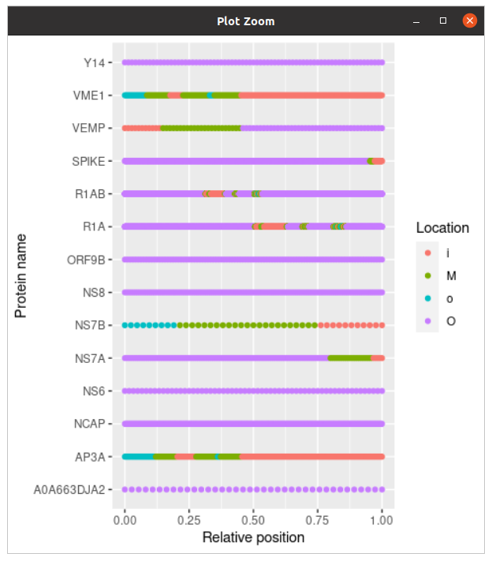

# tmhmm

Branch   |[](https://github.com/richelbilderbeek/tmhmm/actions)     |[](https://travis-ci.com)|[](https://www.codecov.io)
---------|--------------------------------------------------------------------------------------------------------|----------------------------------------------------------------------------------------------------------------------------------------|------------------------------------------------------------------------------------------------------------------------------------------------------
`master` | |[](https://travis-ci.com/richelbilderbeek/tmhmm)|[](https://codecov.io/github/richelbilderbeek/tmhmm/branch/master)
`develop`||[](https://travis-ci.com/richelbilderbeek/tmhmm)|[](https://codecov.io/github/richelbilderbeek/tmhmm/branch/develop)

R package for [TMHMM](https://services.healthtech.dtu.dk/service.php?TMHMM-2.0) [1, 2],
to predict transmembrane helices in proteins.

> Please note that this page is intended for academic users only. Other users are requested
> to contact the Software Package Manager at health-software@dtu.dk

 * [YouTube video](https://youtu.be/WtP9M1Yk9PA) or [download video](http://richelbilderbeek.nl/tmhmm.ogv)

## Install

```
usethis::install_github("richelbilderbeek/tmhmm")
```

Install TMHMM to a default folder:

```
library(tmhmm)
install_tmhmm("https://services.healthtech.dtu.dk/download/28c408dc-ef5e-47ad-a284-66754bcd27f7")
```


The URL can be obtained by requesting a download link at 
the [TMHMM](https://services.healthtech.dtu.dk/service.php?TMHMM-2.0) website 
at [https://services.healthtech.dtu.dk/service.php?TMHMM-2.0](https://services.healthtech.dtu.dk/service.php?TMHMM-2.0).
As this URL expires after four hours, `tmhmm` cannot do this for you.

## Example

```r
library(tmhmm)

# Use an example proteome
fasta_filename <- system.file(
  "extdata",
  "UP000464024.fasta",
  package = "tmhmm"
)

# Predict the topology
topology <- predict_topology(fasta_filename)

# Simplify the protein names
topology$name <- stringr::str_match(
  string = topology$name,
  pattern = "..\\|.*\\|(.*)_SARS2"
)[,2]

# Plot the topology
plot_topology(topology)
```

Each element of the topology sequence denotes the location of each amino acid:

 * `i`: inside
 * `o`: outside
 * `M`: membrane



## FAQ

### Under which operating systems does `tmhmm` work?

`tmhmm` can only work on the set of operating systems TMHMM
works on. Currently, only Linux is supported:

Operating system|Supported by TMHMM|Supported by `tmhmm`
----------------|------------------|---------------------
AIX             |Y                 |?
IRIX32          |Y                 |?
IRIX64          |Y                 |?
Linux           |Y                 |Y
MacOS           |N                 |N
OSF1            |Y                 |?
SunOS           |Y                 |?
Windows         |N                 |N

### Are there similar packages?

These are the ones I use:

 * [pureseqtmr](https://github.com/richelbilderbeek/pureseqtmr): 
   predict membrane protein topology at two levels (TMH or non-TMH),  
   FOSS (i.e. no registration forms needed, thus easy install)

Note that running script shows that TMHMM is approximately 100x faster than PureseqTM:

```
fasta_filename <- system.file("extdata", "UP000464024.fasta", package = "pureseqtmr")
system.time({tmhmm::predict_topology(fasta_filename = fasta_filename)})
system.time({pureseqtmr::predict_topology(fasta_filename = fasta_filename)})
```

Results:

```
> system.time({tmhmm::predict_topology(fasta_filename = fasta_filename)})
   user  system elapsed 
  1.723   0.008   1.733 
> system.time({pureseqtmr::predict_topology(fasta_filename = fasta_filename)})
   user  system elapsed 
117.511   1.746  85.748 
```

Also when running these tools from scripts, the results are similar:

```
time ./bin/decodeanhmm.Linux_x86_64 lib/TMHMM2.0.model UP000464024.fasta -f lib/TMHMM2.0.options
[...]
real	0m1.379s
user	0m1.375s
sys	0m0.004s
```

```
time ./PureseqTM_proteome.sh -i UP000464024.fasta 
71
real	0m53.471s
user	1m36.354s
sys	0m1.426s
```


## References

 * [1] A. Krogh, B. Larsson, G. von Heijne, and E. L. L. Sonnhammer.
   Predicting transmembrane protein topology with a hidden Markov model: 
   Application to complete genomes.
   Journal of Molecular Biology, 305(3):567-580, January 2001.

 * [2] E. L.L. Sonnhammer, G. von Heijne, and A. Krogh.
   A hidden Markov model for predicting transmembrane helices 
   in protein sequences.
   In J. Glasgow, T. Littlejohn, F. Major, R. Lathrop, D. Sankoff, 
   and C. Sensen, editors, 
   Proceedings of the Sixth International Conference 
   on Intelligent Systems for Molecular Biology, 
   pages 175-182, Menlo Park, CA, 1998. AAAI Press.
